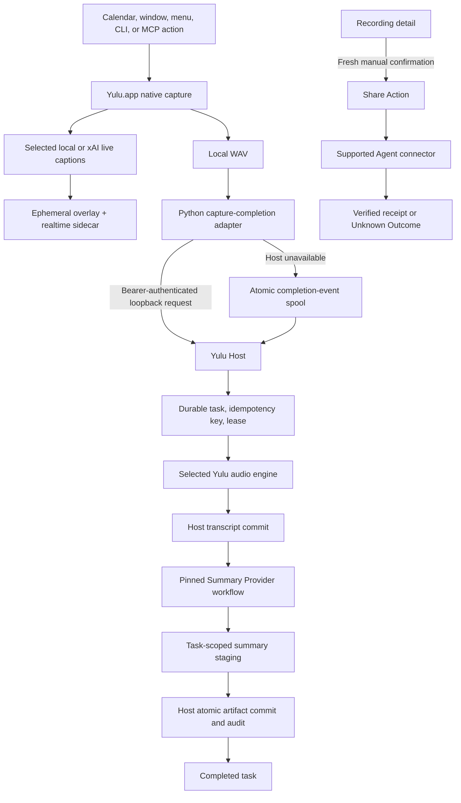
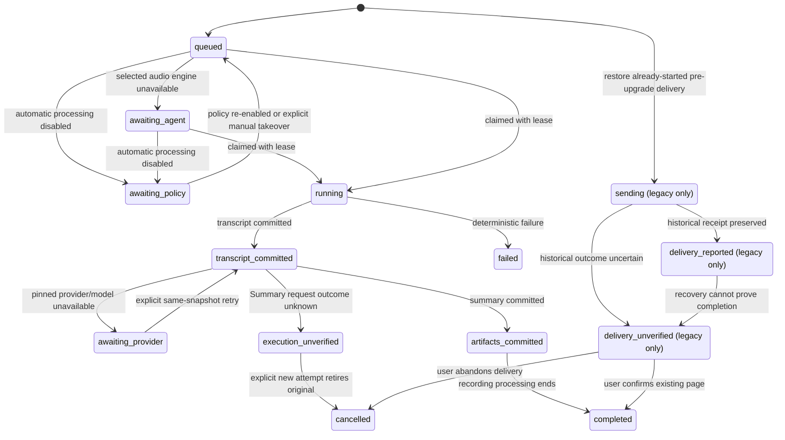

# Yulu Architecture

Yulu is a macOS-native recording product with a durable local Host and explicit
audio and Agent responsibility boundaries. The durable Agent pipeline is
recorded in [`ADR-005`](../yulu/spec/adr/005-agent-native-durable-recording-pipeline.md),
and the current audio-engine decision in
[`ADR-007`](../yulu/spec/adr/007-explicit-audio-transcription-engines.md). The
accepted xAI credential and text-capability boundary is
[`ADR-009`](../yulu/spec/adr/009-grok-cli-compatible-xai-oauth.md).

## Responsibility boundary

Yulu owns only the capabilities that require a trusted product boundary:

- native system-audio and microphone capture;
- explicit local or xAI execution for realtime captions, final transcripts, and dictation;
- macOS permission visibility and repair;
- recording path validation;
- durable tasks, idempotency, leases, recovery, and audit events;
- task-scoped staging, pair validation, atomic target replacement, and
  transactional artifact records;
- explicit authorization and recording of external delivery outcomes;
- local MCP authentication and access control.

The selected Yulu audio engine owns realtime captions, final speech recognition,
and dictation. `local` is the default; `xai` connects directly to xAI with OAuth
authorized in Yulu and stored in macOS Keychain. The exact Summary Provider pinned
at task creation owns summary generation through its explicit xAI, Codex,
or Claude Code connection. Hermes and OpenClaw remain Conversation-only.
The explicit ready connection selected for a new Agent Console session owns its
interactive conversation and connectors. No capability silently falls back to
another provider, model, connection, or credential source.

## Runtime components

| Layer | Current owner | Contract |
|---|---|---|
| Native capture | `Yulu.app`, `audio_daemon.swift` | Capture through ScreenCaptureKit and AVFoundation; expose start/stop/status over `audio_daemon.sock` |
| Capture edge | `record_audio.py`, `meeting_daemon.py`, dictation/status adapters | Control native capture; submit a completed-recording event; atomically spool when Host is unavailable |
| Local Host | `yulu_ui/src/server.ts` | Loopback HTTP, tRPC, WebSocket, static UI, and authenticated MCP |
| Audio transcription service | `audioTranscription.ts` | Lock a session to the explicitly selected local/xAI engine; serve realtime, final, and dictation requests without fallback |
| Local audio engine | `localCaptionManager.ts`, `sherpa_caption_worker.py`, `sherpa_offline_worker.py` | Paraformer INT8 source-separated captions plus FireRedASR offline final transcription; install/test/remove from Settings |
| xAI audio engine | `xaiAudio.ts`, `xaiCredentials.ts`, `xai_keychain.swift` | Direct xAI Streaming/REST STT plus Yulu-owned device OAuth and macOS Keychain storage |
| Realtime coordinator | `realtimeTranscription.ts` | Feed mic/system streams and publish partial/stable captions from the selected engine |
| Durable store | `hostStore.ts` | Persist tasks, pinned summary identity, events, leases, artifact records, and Notion delivery records in `host.sqlite` |
| Pipeline coordinator | `recordingPipeline.ts` | Commit the selected-engine transcript first, then dispatch pinned Summary work and recover failures; recording completion never starts sharing |
| Summary execution | `supportedAgentSummaryAdapter.ts`, `agentGateway.ts` | Run the task's pinned xAI/Codex/Claude Code Summary workflow; retain legacy pinned Hermes artifact work only for recovery/audit; they do not execute production audio transcription |
| Artifact boundary | `artifactStore.ts` | Independently commit transcript, then validate and atomically commit summary artifacts with hashes and provenance |
| General Agent runtime | `agentRuntime.ts`, Agent Console | Resolve Codex, Claude Code, Hermes, OpenClaw, or a configured command for conversation |
| Local context | prompt, glossary, search SQLite databases | Supply instructions and discoverable local data; never execute AI work |

The Host is part of the UI service, but “Host” refers to the trusted local
control plane, not just the browser interface.

## Recording flow



### Capture completion

`meeting_daemon.py` stops native capture and submits:

```json
{
  "audioPath": "/absolute/path/to/Meeting_YYYYMMDD_HHMMSS.wav",
  "title": "Meeting",
  "sendToNotion": false
}
```

The request goes to `POST /api/recordings/completed` on loopback with the local
bearer token. If the Host cannot be reached, the same payload is written with an
atomic rename under `~/Library/Application Support/Yulu/recording-events/`. The Host registers its
watcher before the startup scan and periodically rescans as a lost-event and
transient-failure fallback before replaying valid events.

### Admission and idempotency

The Host accepts only a real WAV inside the configured recordings directory,
with the filename contract `<title>_YYYYMMDD_HHMMSS.wav`. Automatic completion
uses a hash of the resolved path, size, and modification time as the idempotency
key. Re-delivering the same event returns the existing task. A manual reprocess
uses a new key because the user intentionally requested another run.

## Durable task model

`~/Library/Application Support/Yulu/host.sqlite` is the source of truth. A task records:

- recording stem, title, and validated audio path;
- idempotency key, automatic/manual trigger, and pinned Summary Provider/model;
- current state and semantic phase;
- current lease token and attempt number;
- summary instructions and Notion opt-in/destination hint;
- native Agent session identity and any error;
- append-only task events, committed artifact metadata, and delivery metadata.

Only the current lease holder may report progress, commit artifacts, authorize a
delivery, report a delivery, or complete the task. This prevents a stale Agent
attempt from committing after a retry has claimed the task.



On Host restart, interrupted local processing returns to `queued` only when the
Host can prove no Summary request was dispatched. If a pinned Summary request
may have executed but its result cannot be proven, the task becomes
`execution_unverified`; Yulu never retries that execution automatically. The UI
preserves its connection/provider/model and reason, and offers wait, exact
connection repair, or an explicit new Summary attempt that retires the original.
A task that may already have contacted Notion becomes `delivery_unverified`; it
is likewise never blindly replayed as if the side effect were known to have failed.
Likewise, policy-disabled dispatchable tasks move to `awaiting_policy`; the Host
does not claim them, and capture completion receives a permanent policy result
rather than creating a future implicit backlog. The global `enabled` switch also
disables manual work and on-demand transcription. The narrower
`auto_process_recordings` switch pauses only automatic work: dictation and manual
reprocessing remain available, and explicit manual takeover promotes the same
paused task instead of admitting a duplicate.
Provider-paused tasks remain non-dispatching across restart. Their provider/model
snapshot is immutable; Settings changes apply only to newly created work.

## Artifact commit boundary

Each task has a private Host-owned directory under
`~/Library/Application Support/Yulu/agent-tasks/<task-id>/`. The transcription transport stages
`transcript.txt`. Every current Summary path remains behind the same Host-owned
artifact fence:

- direct xAI returns Markdown for the exact pinned model and credential source;
  the Host stages it without exposing either task path;
- Codex and Claude Code return staged Summary output plus exact,
  secret-safe runtime evidence; the Host validates their pinned connection,
  provider, model, disclosure, input artifact, and no-fallback identity before
  staging or committing anything;
- legacy already-pinned Hermes recording work may use the artifact MCP, which
  exposes only task-scoped operations to:

  - read the leased task transcript;
  - stage the complete Markdown summary;
  - commit the fixed `transcript.txt` and `summary.md` pair.

Hermes and OpenClaw are not selectable Summary connections for new work. On the
legacy Hermes path, the Agent calls the authenticated
`recording_artifact_commit` MCP tool with the task ID, lease, and provenance.
On direct and supported-connection paths, the Host performs the equivalent
commit after validating returned output and runtime evidence. In every case the
Host:

1. verifies both files exist, contain text, and are within size limits;
2. checks that the audio filename matches the task recording stem;
3. writes both final files with private permissions using temporary files and
   atomic rename;
4. records SHA-256, byte size, MIME type, provenance, and commit time;
5. advances the task only after both artifact records are stored.

Directly writing a final recording sidecar does not complete a task.

## Recording completion and legacy delivery boundary

Recording Processing ends after transcript and summary artifacts are committed.
No completion event, legacy task flag, or configuration value may begin an
external write. Recording work uses two non-overlapping MCP servers:

- `/mcp/recording-artifact`, configured in Hermes as `yulu_artifact`, exposes
  only task get/progress, task-scoped transcript read, summary stage, and artifact
  commit;
- `/mcp/recording-delivery`, configured as `yulu_delivery`, retains the historical
  committed-summary and Notion delivery endpoints for legacy audit compatibility;
  its begin endpoint rejects every new delivery.

The general `/mcp` server remains the full Yulu capability surface for interactive
Agents. The artifact session receives only `yulu_artifact`; it has neither `file`
nor any connector toolset. After an upgrade, unstarted legacy intent is cleared.
Started and reported legacy deliveries recover to `delivery_unverified`, remain
unclaimable, and require explicit confirm-or-abandon reconciliation. Their delivery
rows and completed receipts remain auditable, and ordinary retry cannot cross the
Unknown Outcome fence. A later manual Share Action is a new, separately confirmed
operation governed by ADRs 0025 and 0026.

## General Agent separation

The recording pipeline and interactive Agent Console are deliberately separate:

- The task-pinned Summary connection resolves xAI, Codex, or Claude Code
  independently from Conversation. Hermes and OpenClaw are never
  Summary choices.
- New conversations resolve only the explicit ready connection selected in the
  Agent Connection Center. Existing sessions keep their pinned native identity.
- Audio uses the separately selected local or xAI engine.
- These boundaries fail closed: unavailable pinned work pauses with its committed
  transcript or conversation history. The Host never falls back to another
  Summary or Conversation connection.
- The general Agent's connector configuration stays with that Agent. Yulu may
  expose local recordings, search, prompts, glossary, health, and task tools, but
  it does not proxy arbitrary connector calls.

Connector ownership is partitioned by intent. Recording Processing owns only the
local transcript and summary commits. A recording Share belongs to a fresh manual
Share Action with its own pinned destination; a Notion action requested inside an
unrelated conversation belongs to the selected general Agent. These paths must not
silently trigger one another.

## Python capture edge

Python remains useful for macOS workflow glue, but it is not an AI control plane.
Its runtime responsibilities are limited to:

- capture start/stop/status calls;
- meeting detection and scheduling around capture;
- dictation audio capture plus authenticated Host transport;
- completion-event delivery or durable local spooling;
- local clipboard, notification, and permission helpers.

Adding an Agent capability to Python is an architecture regression. Speech
behavior belongs in the selected Yulu audio engine; summary, conversation, and
connector behavior belongs in the appropriate Agent behind existing Host contracts.

## Local Host security

The Host:

- binds to `127.0.0.1`;
- rejects Host headers other than localhost/loopback;
- requires a constant-time-checked per-install bearer token for MCP, completion,
  warm-up, and audio transcription requests;
- accepts transcription paths only inside the recording or dictation roots;
- exposes audio files by basename from the configured recording directory;
- stores task workspaces and databases under the machine-local config root.

`GET /healthz` is intentionally unauthenticated and reports only process health.
It proves that the loopback Host is listening, not that Hermes or the recording
pipeline is healthy.

## Privacy boundary

Raw capture is local. Selecting xAI explicitly authorizes Yulu to send audio
directly to xAI; selecting local keeps it on the Mac. Yulu stores the xAI OAuth
grant in macOS Keychain and never sends it to an Agent. The summary Agent receives the committed
transcript and bounded task instructions, not an audio-transcription role.

Sharing requires a fresh explicit manual action and confirmation. Other interactive
connector actions belong to the general Agent and follow that Agent's own consent
and credential model. Yulu configuration must not contain connector secrets.

Runtime databases, bearer tokens, task workspaces, sockets, locks, and event
spools must remain machine-local. A user may choose another recording content
directory, but live runtime state must not be placed in a sync folder.

## macOS and platform boundary

macOS is the only shipped capture arm. ScreenCaptureKit, AVFoundation, TCC,
launchd, Accessibility, and menu-bar integration are intentional platform
details. Neutral platform seams may describe capture, paths, permissions,
dependencies, and service lifecycle, but another platform is not supported until
it supplies equivalent native permission and capture behavior.

Do not replace the macOS capture arm with a cross-platform Python recorder. The
portable boundary starts after a validated recording artifact exists.

## Non-goals

- Provider selection or model tuning inside Yulu.
- A Yulu-owned summary, conversation, or connector runtime.
- Hidden external delivery or automatic replay of uncertain side effects.
- Multiple independent artifact commit paths.
- Cloud synchronization of live Host state.

## Related documents

- [`configuration.md`](configuration.md)
- [`operations.md`](operations.md)
- [`ADR index`](../yulu/spec/adr/README.md)
